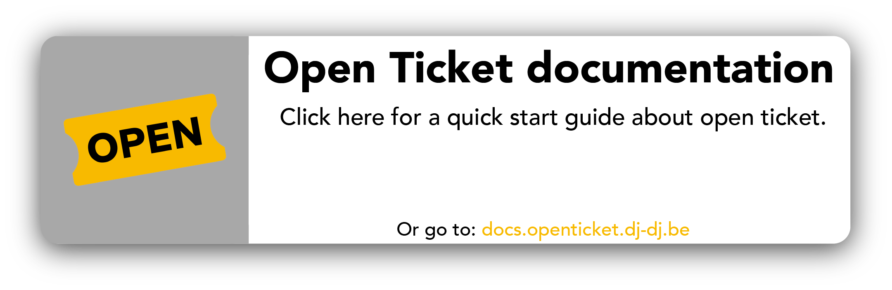

# Open Ticket
       

Open ticket is the most configurable open-source ticket bot for discord! Made with the newest technologies. Like: Slash commands, transcripts, multiple ticket types, buttons & dropdowns!
Start using it now, you can do anything!

*We love to hear suggestions for more features!*

 

### Thanks to these people:
- DJ-Lite: for doing the administration
- Sanke: for translation & new ideas
- Everyone that reported a bug
#### And our translators!
- ExothDE
- 1x1
- Redactado
- t0miiis
- josuens14
- M4
- David.
- Maurizio

## features
- discord interaction buttons
- slash & text commands
- close, delete & re-open tickets
- translation in 10 different languages
- transcripts
- add/remove users from a ticket
- a lot of customisation options.
- tickets, reaction roles & links are all possible!
- choose between buttons or dropdowns!
- discord.js v14
- everyting is configurable
- custom API + plugins
- unlimited tickets spread over multiple messages
- close with reason

*comming soon*
- share transcripts
- view transcripts in html

## quick start
[Click here to start your adventure!](https://docs.openticket.dj-dj.be/quick-start)

## documentation

## information

_v3.0.1_

changelog: [click here](https://docs.openticket.dj-dj.be/other/changelog)

© 2022 - DJdj Development | [website](https://www.dj-dj.be) | [discord](https://discord.dj-dj.be) | [terms of service](https://www.dj-dj.be/terms)